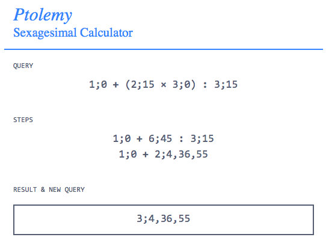

# Ptolemy
## A [Sexagesimal](http://en.wikipedia.org/wiki/Sexagesimal) Calculator for Ancient Astronomy

This is a web-based sexagesimal calculator for doing ancient astronomy. It is not exactly done. And yet, there is a live version available [here](http://ptolemy.herokuapp.com).

It follows the notation conventions of [G.J. Toomer's translation](http://www.amazon.com/Ptolemys-Almagest-Ptolemy/dp/0691002606/ref=sr_1_1?ie=UTF8&qid=1379259860&sr=8-1&keywords=g.j.+toomer+almagest) of Ptolemy's *Almagest*. `1.5` is written as `1;30`, where `30` represents thirty parts of sixty. Likewise, `0;30,30` is equal to `0 + 30/60 + 30/(60^2)`. Whole numbers are in decimal notation. Division is written with `:` instead of `/`, though `/` will be automatically converted to `:`. Parentheses are respected, though there may still be some instances where they do not work.

In their current iteration, multiplication, division and exponents convert the number to decimal, perform the operation, and convert the number back to sexagesimal. This is not entirely accurate. Addition and subtract *are* completely accurate and are performed in base 60.

You can also use `crd` to take the chord of a number. Example: `3;45*crd1;2,50`. As written, this is not calculated using Ptolemy's method, though it will be eventually.

### What it does and doesn't do

The calculator takes a query like `3;0+2;30*4;45,45` and returns a value in sexagesimal. Order of operations is PEMDAS. Decimal numbers and mixed decimal-sexagesimal expressions are also supported, e.g. `1;30*1.5`. An example:

### Requirements

Ptolemy requires [Flask](http://flask.pocoo.org).