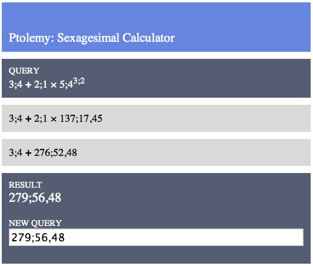

# Ptolemy
## A [Sexagesimal](http://en.wikipedia.org/wiki/Sexagesimal) Calculator for Ancient Astronomy

This is a web-based sexagesimal calculator for doing ancient astronomy. It is not at all done. And yet, there is a live version available [here](http://ptolemy.herokuapp.com).

It follows the notation conventions of [G.J. Toomer's translation](http://www.amazon.com/Ptolemys-Almagest-Ptolemy/dp/0691002606/ref=sr_1_1?ie=UTF8&qid=1379259860&sr=8-1&keywords=g.j.+toomer+almagest) of Ptolemy's *Almagest*. `1.5` is written as `1;30`, where `30` represents thirty parts of sixty. Likewise, `0;30,30` is equal to `0 + 30/60 + 30/(60^2)`. Whole numbers are in decimal notation. Division is written with `:` instead of `/`.

As written, it converts sexagesimal numbers to decimal, performs the calculations, and converts them back to decimal. This is a big problem. For example, `1;0 + 1;0 + 1;01` returns `3;0;59`. 

### What it does and doesn't do

The calculator takes a query like `3;0 + 2;30 * 4;45,45` and returns a value in sexagesimal. Order of operations is PEMDAS, though there is no support yet for parentheses. Decimal numbers and mixed decimal-sexagesimal expressions are also supported, e.g. `1;30 * 1.5`. An example:

### Todo and bugs

Here is a very preliminary todo list:

* Add input verification.
* Rewrite main mathematical functions without reliance on decimal calculations.
* Add support for parentheses
* Add support for trigonometry, both calculated and using Ptolemy's values from the Chord Table
* Add an option to pare numbers down to a certain number of places at each step to simulate calculation by hand.
* Feed templates a list of steps to render instead of rendering those in `ptolemy.py`.

### Requirements

Ptolemy requires [Flask](http://flask.pocoo.org).

### Recent Updates

##### 2013-09-23b

* Added basic error handling.
* Got more HTML out of `ptolemy.py`.
* Small changes to CSS and HTML.

##### 2013-09-23a

* Switched from `Pesto` to `Flask` to run on Heroku.
* Switched some variables to snake_case. Will be doing more of this where needed.
* Started using templates for html generation.
* Started work on moving code into objects.
* Changed the CSS and HTML a bit.
* Added instructions to the home page.
* Created a way to display warnings and errors to the user.

##### 2013-09-15

* Added exponents. Use `^`.
* Added evaluation of a single number. Can now be used as a simple decimal to sexagesimal converter.
* Added an optional argument to `sexagesimal()` for number of places. Defaults to 2.
* Cleaned up display of expressions.
* Fixed Bug: Calculations with just two numbers give an error. Oops.
* Initial commit.